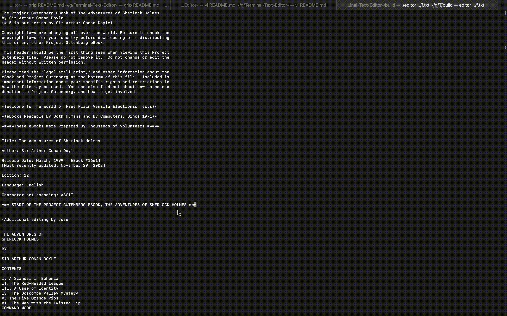

# Terminal Text Editor

## About
This was a project that I developed during my junior year of college to become familiar with the c++ language and design patterns such as the observer, model - view - controller, and command patterns.
 
### Installation 
Run this line in terminal. Replace /YOUR-DIRECTORY with the directory you want this repositiory to be cloned in. 
```
git clone https://github.com/sammybishara/Terminal-Text-Editor- /YOUR-DIRECTORY
```
Head to the directory where the terminal text editor is downloaded. Run the following commands in terminal to build the text editor
```
cd Terminal-Text-Editor-/
mkdir build
cd build
cmake ..
make
```
### Usage
Head to the build directory. 
Run the following line replacing YOUR-FILE with the file that you want to open in the text editor. If the file is not found by the text editor, it will create that file. 
```
./editor YOUR-FILE.txt
```
## Commands and Features 

### Command Mode and Insert Mode
The text editor will launch in command mode. Command mode allows you to only edit the document through commands. Press the <kbd>I</kbd> key to enter insert mode. Insert mode allows to edit the document 
by typing the text on your keyboard. Press the <kbd>ESC</kbd> key to switch back to command mode.

### Paging


### TextWrapping


### Boarders
While in command mode, press <kbd>Ctrl</kbd> + <kbd>B</kbd> to enable boarders around the view.
 

### Line Numbers
While in command mode, press <kbd>Ctrl</kbd> + <kbd>L</kbd> to enable line numbers in the view.
 

### Copy and Paste
While in command mode, press <kbd>Ctrl</kbd> + <kbd>C</kbd> to copy an entire line from the view. Press <kbd>Ctrl</kbd> + <kbd>V</kbd> to paste the copied row.


### Undo 
While in command mode, press <kbd>Ctrl</kbd> + <kbd>Z</kbd> to undo the most recent set of changes to the document. Each time insert mode is entered it will be counted as one set of changes. 
 

### Redo
While in command mode, press <kbd>Ctrl</kbd> + <kbd>R</kbd> to redo the set of changes that were most recently undone.
 

### Keyword Highlighting
Words added to the keywords.txt will be highlighted by the editor. Support for adding highlighting for different programming languages will be added.  
 
